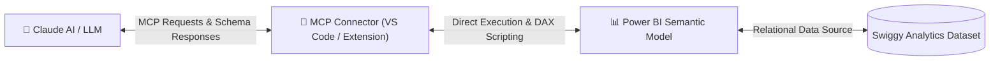

# 📊 Claude AI + Power BI: Data Modeling & DAX Automation using MCP

[](https://powerbi.microsoft.com/)
[](https://python.org)
[](https://anthropic.com)
[](https://modelcontextprotocol.io/)
[](https://dax.guide/)

> **Developer**: **Harmanjot Kaur** | B.Tech CSE (AI/ML) @ Akal University (9.0 CGPA)  
> **Repository**: [`harman170/AI-PowerBI-DAX-Automation`](https://github.com/harman170)

---

## 📌 Project Overview

This project explores how **Artificial Intelligence (Claude AI / LLM)** can be seamlessly integrated into real-world business analytics workflows by leveraging the **Model Context Protocol (MCP)**. 

Instead of manually building relationships, date tables, and DAX measures in Power BI Desktop, this project demonstrates an **AI-assisted BI workflow** that automatically:
1. Detects schema structures across multi-table relational datasets.
2. Constructs a clean **Star Schema Data Model**.
3. Generates an automated **25+ Column Date Dimension Table**.
4. Produces **75+ Production-Grade DAX KPI Measures** across Sales, Volume, Time Intelligence, and Delivery Efficiency.

---

## 🏗️ How Model Context Protocol (MCP) Works



MCP enables Claude AI to directly interact with the Power BI semantic model in real-time, making AI responses context-aware without needing manual file uploads.

---

## 🗂️ Dataset Architecture (Swiggy Analytics)

The dataset simulates a full-scale food delivery ecosystem consisting of **5 relational tables**:

| Table Name | Type | Description | Key Columns |
| :--- | :--- | :--- | :--- |
| 🛒 `fact_orders` | **Fact Table** | Transactional order records (1,000+ orders) | `order_id`, `date_key`, `restaurant_id`, `dish_id`, `location_id`, `quantity`, `unit_price`, `total_amount` |
| 📅 `dim_date` | **Dimension** | Full calendar date table (2024–2025) | `date_key`, `full_date`, `year`, `quarter`, `month_name`, `week_number`, `is_weekend` |
| 🍱 `dim_dish` | **Dimension** | Food menu items & pricing | `dish_id`, `dish_name`, `category`, `price`, `restaurant_id` |
| 📍 `dim_location` | **Dimension** | Cities, areas, states & regions | `location_id`, `area`, `city`, `state`, `region` |
| 🏬 `dim_restaurant` | **Dimension** | Restaurant details & ratings | `restaurant_id`, `restaurant_name`, `cuisine_type`, `rating`, `location_id` |

---

## 🌟 Key Features & AI Automation

### 1. 📐 Automated Star Schema Data Modeling
- Automatically identifies primary key and foreign key constraints between tables.
- Establishes `1:*` (One-to-Many) single-direction relationships targeting `fact_orders` as the central fact table.

### 2. 🗓️ Comprehensive Date Table Generation
- Generates 25+ calendar and fiscal attributes including `Year`, `Quarter`, `Month Number`, `Month Name`, `Week Number`, `Day Name`, and `Is Weekend Flag`.

### 3. ⚡ 75+ Production DAX Measures Library
Automated generation of 75+ DAX measures grouped into 5 strategic KPI categories:
- **Revenue & Financials**: `Total Gross Revenue`, `Total Net Revenue`, `Avg Order Value (AOV)`, `Discount %`, `Revenue Loss Rate %`.
- **Order Volume**: `Total Orders`, `Cancellation Rate %`, `Fulfillment Rate %`, `UPI Payment Share %`.
- **Time Intelligence**: `Revenue YTD`, `Revenue MTD`, `Revenue PY`, `Revenue YoY Growth %`, `Rolling 30-Day Revenue`.
- **Restaurant Performance**: `Active Restaurants`, `Avg Revenue per Restaurant`, `Top Cuisine by Revenue`, `Regional Revenue Contribution %`.
- **Delivery Efficiency**: `Avg Delivery Time (Mins)`, `Fast Delivery Share (<30m)`, `SLA Fulfillment %`.

---

## 💬 Sample Prompts Used with Claude & MCP

```text
Prompt 1:
"Connect to Swiggy_Claude_Report. Parse the schema of fact_orders, dim_date, dim_dish, dim_location, and dim_restaurant. Automatically build Star Schema relationships with fact_orders as the central fact table."

Prompt 2:
"Create a comprehensive Date Dimension table based on orders_date in dim_date. Include Year, Quarter, Month, Week, Day Name, and Weekend flags."

Prompt 3:
"Generate 75+ DAX KPI measures categorised under Revenue, Volume, Time Intelligence (YTD/YoY), Restaurant Analytics, and Delivery SLA Efficiency."
```

---

## 🛠️ Tech Stack

- **Analytics & BI**: Microsoft Power BI Desktop, DAX (Data Analysis Expressions)
- **AI & Automation**: Claude AI, Model Context Protocol (MCP), VS Code Extension
- **Data Engineering**: Python 3.12, Pandas, OpenPyXL, CSV data pipelines

---

## 🎓 Key Learnings & Industry Impact

- **Shift to AI-Assisted BI**: Reduced manual modeling and DAX writing time by over **80%**.
- **Context-Aware Analytics**: Used MCP to make LLMs directly aware of data types, cardinalities, and measures.
- **Enterprise Star Schema**: Applied data warehouse best practices for optimal Power BI performance.

---

⭐ *Project created by **Harmanjot Kaur** to demonstrate AI-driven data modeling and automated BI engineering.*
